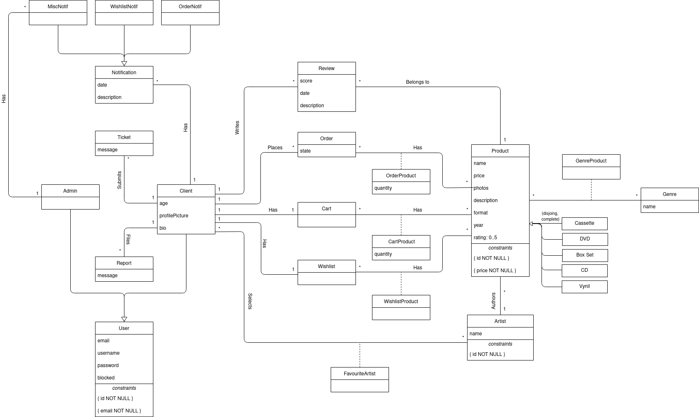

# EBD: Database Specification Component

# A4: Conceptual Data Model (UML)

### 1. Class Diagram:



# A5: Relational Schema:

|Relation Reference|Relation Compact Notation|
|---|---|
|R01|user(<ins>id</ins>, email **UK NN**, username **UK NN**, password **NN**)|
|R02|client(<ins>user_id</ins>->user, email->user **UK NN**, username->user **NN**, password->user **NN**, cart_id->cart **NN**, wishlist_id->wishlist **NN**, is_blocked **NN**)|
|R03|admin(<ins>user_id</ins>->user,email->user **UK NN**, username->user **NN**, password->user **NN**)|
|R04|artist(<ins>id</ins>, name **NN**, description)|
|R05|client_artist(<ins>client_id</ins>->client, <ins>artist_id</ins>->artist)|
|R06|product(<ins>id</ins>, name **NN**, artist_id->artist **NN**, genre, price **NN**, stock **NN**, format **NN CK** format **IN** Formats, year **NN**, description **DF** NULL, rating **DF** NULL)|
|R07|genre(<ins>id</ins>, name **NN**)|
|R08|genre_product(<ins>genre_id</ins>->genre, <ins>product_id</ins>->product)
|R09|review(<ins>id</ins>, client_id->client **NN**, product_id->product **NN**, score **NN CK** score > 0 AND score <= 5, date **NN**, description **DF** NULL)|
|R10|order(<ins>id</ins>, client_id->client **NN**, state **NN CK** state **IN** orderStates)|
|R11|order_product(<ins>order_id</ins>->order, <ins>product_id</ins>->product, quantity)
|R12|wishlist(<ins>id</ins>, client_id->client **NN**)|
|R13|wishlist_product(<ins>wishlist_id</ins>->wishlist, <ins>product_id</ins>->product)|
|R14|cart(<ins>id</ins>, client_id->client **NN**)
|R15|cart_product(<ins>cart_id</ins>->cart, <ins>product_id</ins>->product, quantity **NN**)
|R16|notification(<ins>id</ins>, date **NN**, description **DF** NULL)|
|R17|misc_notif(<ins>notification_id</ins>->notification)|
|R18|wishlist_notif(<ins>notification_id</ins>->notification)|
|R19|order_notif(<ins>notification_id</ins>->notification)|
|R20|ticket(<ins>id</ins>, user_id->user **NN**, message **NN**)|
|R21|report(<ins>id</ins>, reporter_id->client **NN**, reported_id->client **NN**, message **NN**)

### Legend:

```
    UK = UNIQUE KEY
    NN = NOT NULL
    DF = DEFAULT
    CK = CHECK
```

## Domains:
|Domain Name|Domain Specification|
|---|---|
|**product_format**|ENUM('CD', 'Vinyl', 'Cassette', 'DVD', 'Box Set')|
|**order_state**|ENUM('Processing', 'Shipped', 'Delivered')|
|**notif_type**|ENUM('Order', 'Wishlist', 'Misc')|

## Schema Validation

|**Table R01**|**User**|
|---|---|
|**Keys**|{id}, {username}, {email}|
|**Functional Dependencies**:||
|FD0101|id -> {email, username, password}|
|FD0102|email -> {id, username, password}|
|FD0103|username -> (id, email, password)|
|**Normal Form**|BCNF|

|**Table R02**|**Client**|
|---|---|
|**Keys**|{id}, {email}|
|**Functional Dependencies**:||
|FD0201|id -> {email, username, password, cart_id, wishlist_id, is_blocked}|
|FD0202|email -> {id, username, password, cart_id, wishlist_id, is_blocked}|
|**Normal Form**|BCNF|

|**Table R03**|**Admin**|
|---|---|
|**Keys**|{id}, {email}|
|**Functional Dependencies**:||
|FD0301|id -> {email, username, password}|
|FD0302|email -> {id, username, password}|
|**Normal Form**|BCNF|

|**Table R04**|**Artist**|
|---|---|
|**Keys**|{id}|
|**Functional Dependencies**:||
|FD0401|id -> {name, description}|
|**Normal Form**|BCNF|

|**Table R05**|**Client_Artist**|
|---|---|
|**Keys**|{client_id, artist_id}|
|**Functional Dependencies**:||
|**Normal Form**|BCNF|

|**Table R06**|**Product**|
|---|---|
|**Keys**|{id}|
|**Functional Dependencies**:||
|FD0601|id -> {name, artist_id, price, stock, genre, format, year, description, rating}|
|**Normal Form**|BCNF|

|**Table R07**|**Genre**|
|---|---|
|**Keys**|{id}|
|**Functional Dependencies**:||
|FD0701|id -> {name}|
|**Normal Form**|BCNF|

|**Table R08**|**Genre_Product**|
|---|---|
|**Keys**|{genre_id, product_id}|
|**Functional Dependencies**:||
|None||
|**Normal Form**|BCNF|

|**Table R09**|**Review**|
|---|---|
|**Keys**|{id}|
|**Functional Dependencies**:||
|FD0901|id -> {client_id, product_id, score, date, description}|
|**Normal Form**|BCNF|

|**Table R10**|**Order**|
|---|---|
|**Keys**|{id}|
|**Functional Dependencies**:||
|FD1001|id -> {client_id, product_id, state}|
|**Normal Form**|BCNF|

|**Table R11**|**Order_Product**|
|---|---|
|**Keys**|{order_id, product_id}|
|**Functional Dependencies**:||
|FD1101|{order_id, product_id} -> {quantity}|
|**Normal Form**|BCNF|

|**Table R12**|**Wishlist**|
|---|---|
|**Keys**|{id}|
|**Functional Dependencies**:||
|FD1201|id -> {client_id}|
|**Normal Form**|BCNF|

|**Table R13**|**Wishlist_Product**|
|---|---|
|**Keys**|{wishlist_id, product_id}|
|**Functional Dependencies**:||
|None||
|**Normal Form**|BCNF|

|**Table R14**|**Cart**|
|---|---|
|**Keys**|{id} |
|**Functional Dependencies**:||
|FD1401|id -> {client_id}|
|**Normal Form**|BCNF|

|**Table R15**|**Cart_Product**|
|---|---|
|**Keys**|{cart_id, product_id}|
|**Functional Dependencies**:||
|FD1501|{cart_id, product_id} -> {quantity}|
|**Normal Form**|BCNF|

|**Table R16**|**Notification**|
|---|---|
|**Keys**|{id}|
|**Functional Dependencies**:||
|FD1601|id -> {date, description}|
|**Normal Form**|BCNF|

|**Table R17**|**Misc_Notif**|
|---|---|
|**Keys**|{notification_id}|
|**Functional Dependencies**:||
|None||
|**Normal Form**|BCNF|

|**Table R18**|**Wishlist_Notif**|
|---|---|
|**Keys**|{notification_id}|
|**Functional Dependencies**:||
|None||
|**Normal Form**|BCNF|

|**Table R19**|**Order_Notif**|
|---|---|
|**Keys**|{notification_id}|
|**Functional Dependencies**:||
|None||
|**Normal Form**|BCNF|

|**Table R20**|**Ticket**|
|---|---|
|**Keys**|{id}|
|**Functional Dependencies**:||
|FD2001|id -> {user_id, message}|
|**Normal Form**|BCNF|

|**Table R21**|**Report**|
|---|---|
|**Keys**|{id}|
|**Functional Dependencies**:||
|FD2101|id -> {reporter_id, reported_id, message}|
|**Normal Form**|BCNF|

<br>

# A6

## Database Workload

|**Relation**|**Relation name**|**Order of magnitude**|**Estimated growth**
|---|---|---|---|
|R01|user|1k|100/day|
|R02|client|100|10/day|
|R03|admin|10|1/month|
|R04|artist|1k|10/day|
|R05|client_artist|100|10/day|
|R06|product|1k|100/day|
|R07|genre|10|1/month|
|R08|genre_product|1k|100/day|
|R09|review|100|10/day|
|R10|order|100|10/day|
|R11|order_product|100|10/day|
|R12|wishlist|100|10/day|
|R13|wishlist_product|1k|10/day|
|R14|cart|100|10/day|
|R15|cart_product|100|10/day|
|R16|notification|100|10/day|
|R17|misc_notif|10|1/day|
|R18|wishlist_notif|10|1/day|
|R19|order_notif|10|1/day|
|R20|ticket|10|1/day|
|R21|report|10|1/day|

## Proposed Indexes
### Performance Indexes

|**Index**|IDX01|
|---|---|
|**Index Relation**|Product|
|**Index Attribute**|artist_id|
|**Index Type**|Hash|
|**Cardinality**|High|
|**Clustering**|No|
|**Justification**|Table 'Product' is very large. Several queries need to frequently filter access to the works by artist or category. Filtering is done by exact match, and, seeing as how we don't want to apply clustering, a hash index is best suited.|
|**SQL CODE**|
```SQL
CREATE INDEX product_artist ON Product USING hash (artist_id);
```

|**Index**|IDX02|
|---|---|
|**Index Relation**|Product|
|**Index Attribute**|price|
|**Index Type**|B-tree|
|**Cardinality**|Medium|
|**Clustering**|No|
|**Justification**|Table 'Product' is very large. Several queries need to frequently filter products based on their *price*. Since filtering is done by applying comparison on *price* and clustering is intended, a B-tree type index is best suited. Despite its medium cardinality, the frequent table updates make it not viable for clustering.|
|**SQL CODE**|
```SQL
CREATE INDEX product_price ON Product USING btree (price);
```

|**Index**|IDX03|
|---|---|
|**Index Relation**|ProductGenre|
|**Index Attribute**|genre_id|
|**Index Type**|Hash|
|**Cardinality**|High|
|**Clustering**|No|
|**Justification**|Table 'ProductGenre' is very large. By indexing the *genre_id*, we can easily filter products belonging to the same genre. Since filtering is done by exact match and clustering is not needed, a hash index is best suited for this index.|
|**SQL CODE**|
```SQL
CREATE INDEX product_genre ON ProductGenre USING hash (genre_id);
```

### Full-text Search Indexes

|**Index**|IDX11|
|---|---|
|**Index Relation**|Product|
|**Index Attribute**|name, tracklist|
|**Index Type**|GIN|
|**Clustering**|No|
|**Justification**|Full-text search features to browse for products based on matching product name or track name, from the tracklists. Index type is GIN because these fields are not expected to change often, if at all.|
|**SQL CODE**|
```SQL
ALTER TABLE Product
ADD COLUMN tsvectors TSVECTOR;

CREATE FUNCTION product_search_update() RETURNS TRIGGER AS $$
BEGIN

    IF TG_OP = 'INSERT' THEN
        NEW.tsvectors = (
            setweight(to_tsvector('english', NEW.name), 'A') ||
            setweight(to_tsvector('english', NEW.description), 'C')
        );
    END IF;
    IF TG_OP = 'UPDATE' THEN
        IF (NEW.name <> OLD.name) THEN
            NEW.tsvectors = (
                setweight(to_tsvector('english', NEW.name), 'A') ||
                setweight(to_tsvector('english', NEW.description), 'C')
            );
        END IF;
    END IF;
    RETURN NEW;

END $$
LANGUAGE plpgsql;

CREATE TRIGGER product_search_update
    BEFORE INSERT OR UPDATE ON Product
    FOR EACH ROW
    EXECUTE PROCEDURE product_search_update();
```

## Triggers

|**Trigger**|TRIGGER01|
|---|---|
|**Description**|Delete an Artist gracefully, removing all its associations|
|**SQL CODE**|
```SQL
CREATE FUNCTION delete_artist() RETURNS TRIGGER AS 
$BODY$
BEGIN

    DELETE FROM Product
    WHERE artist_id = OLD.id;

    DELETE FROM FavArtist
    WHERE artist_id = OLD.id;

    RETURN NEW;
    
END
$BODY$
LANGUAGE plpgsql;

CREATE TRIGGER delete_artist
    BEFORE DELETE ON Artist
    FOR EACH ROW
    EXECUTE PROCEDURE delete_artist();
```

|**Trigger**|TRIGGER02|
|---|---|
|**Description**|Update a Product's rating after a new Review|
|**SQL CODE**|
```SQL
CREATE FUNCTION review_product()
RETURNS TRIGGER AS 
$BODY$
BEGIN

    IF TG_OP = 'INSERT' THEN
        UPDATE Product
        SET rating = ((SELECT SUM(score) FROM Review WHERE NEW.product_id = product_id))::float / (SELECT COUNT(*) FROM Review WHERE NEW.product_id = product_id)
        WHERE id = NEW.product_id;
    END IF;
    IF TG_OP = 'UPDATE' THEN
        IF (NEW.score <> OLD.score) THEN
            UPDATE Product
            SET rating = ((SELECT SUM(score) FROM Review WHERE NEW.product_id = product_id))::float / (SELECT COUNT(*) FROM Review WHERE NEW.product_id = product_id)
            WHERE id = NEW.product_id;
        END IF;
    END IF;
    IF TG_OP = 'DELETE' THEN
        IF ((SELECT COUNT(*) FROM Review WHERE OLD.product_id = product_id) = 0) THEN
            UPDATE Product
            SET rating = NULL
            WHERE id = OLD.product_id;
        ELSE
            UPDATE Product
            SET rating = ((SELECT SUM(score) FROM Review WHERE OLD.product_id = product_id))::float / (SELECT COUNT(*) FROM Review WHERE OLD.product_id = product_id)
            WHERE id = OLD.product_id;
        END IF;
    END IF;
    RETURN NEW;

END
$BODY$
LANGUAGE plpgsql;

CREATE TRIGGER review_product
    AFTER INSERT OR UPDATE ON Review
    FOR EACH ROW
    EXECUTE PROCEDURE review_product();
```

|**Trigger**|TRIGGER03|
|---|---|
|**Description**|Update a Product's stock on purchase|
|**SQL CODE**|
```SQL
CREATE FUNCTION update_stock()
RETURNS TRIGGER AS 
$BODY$
BEGIN 

    UPDATE Product
    SET stock = stock - NEW.quantity
    WHERE id = NEW.product_id;
    RETURN NEW;

END
$BODY$
LANGUAGE plpgsql;

CREATE TRIGGER update_stock
    AFTER INSERT ON OrderProduct
    FOR EACH ROW
    EXECUTE PROCEDURE update_stock();
```

|**Trigger**|TRIGGER04|
|---|---|
|**Description**|Delete a Product gracefully, removing all its associations|
|**SQL CODE**|
```SQL
CREATE FUNCTION delete_product() RETURNS TRIGGER AS 
$BODY$
BEGIN

    DELETE FROM ProductGenre
    WHERE product_id = OLD.id;

    DELETE FROM Review
    WHERE product_id = OLD.id;

    DELETE FROM OrderProduct
    WHERE product_id = OLD.id;

    DELETE FROM CartProduct
    WHERE product_id = OLD.id;

    DELETE FROM WishlistProduct
    WHERE product_id = OLD.id;

    RETURN NEW;

END
$BODY$
LANGUAGE plpgsql;

CREATE TRIGGER delete_product
    BEFORE DELETE ON Product
    FOR EACH ROW
    EXECUTE PROCEDURE delete_product();
```

## Transactions

|**Transaction**|TRAN01|
|---|---|
|**Description**|Purchase products|
|**Justification**|We must have a transaction to make sure that every purchase is done separately and relevant information is updated before any other action that affects it is executed. If an error occurs, for example, failing to insert a new order in the Order or OrderProduct table, a ROLLBACK is issued. To preserve the order_id and the product_id in case of a concurrent transaction, the isolation level is Repeatable Read. The amount of inserts in the OrderProduct table changes depending on the number of different products inserted, but to reduce the amount of code displayed here we will assume only one product is bought in this example.|
|**SQL CODE**|
```SQL
BEGIN TRANSACTION;

SET TRANSACTION ISOLATION LEVEL REPEATABLE READ;

-- Insert order
INSERT INTO Orders (user_id, state)
VALUES ($user_id, $state);

-- Insert association between order and product
INSERT INTO OrderProduct (order_id, product_id, quantity)
VALUES (currval('order_id_seq'), $product_id, $quantity);

END TRANSACTION;
```    

## A.1 Database schema

```SQL
-- Drop schema if existant
DROP SCHEMA lbaw22123 CASCADE;


-- Create group schema and set it as search path
CREATE SCHEMA lbaw22123;
SET search_path TO lbaw22123;

-- Enumerations
CREATE TYPE PRODUCT_FORMAT AS ENUM('Vinyl', 'CD', 'Cassette', 'DVD', 'Box Set');
CREATE TYPE ORDER_STATE AS ENUM('Processing', 'Shipped', 'Delivered');
CREATE TYPE NOTIF_TYPE AS ENUM('Order', 'Wishlist', 'Misc');

-- Drop existent tables
DROP TABLE IF EXISTS Users;
DROP TABLE IF EXISTS Artist;
DROP TABLE IF EXISTS FavArtist;
DROP TABLE IF EXISTS Product;
DROP TABLE IF EXISTS Genre;
DROP TABLE IF EXISTS ProductGenre;
DROP TABLE IF EXISTS Review;
DROP TABLE IF EXISTS Orders;
DROP TABLE IF EXISTS OrderProduct;
DROP TABLE IF EXISTS CartProduct;
DROP TABLE IF EXISTS WishlistProduct;
DROP TABLE IF EXISTS Notif;
DROP TABLE IF EXISTS Ticket;
DROP TABLE IF EXISTS Report;


-- Table creation

CREATE TABLE Users(
    id          SERIAL PRIMARY KEY,
    cart_id     SERIAL UNIQUE,
    wishlist_id SERIAL UNIQUE,
    email       VARCHAR(255) UNIQUE NOT NULL,
    username    VARCHAR(30) NOT NULL,
    password    VARCHAR(30) NOT NULL,
    is_blocked  BOOLEAN NOT NULL,
    is_admin    BOOLEAN NOT NULL
);

CREATE TABLE Artist(
    id          SERIAL PRIMARY KEY,
    name        VARCHAR(100) UNIQUE NOT NULL,
    description TEXT DEFAULT NULL
);

CREATE TABLE FavArtist(
    user_id     INTEGER REFERENCES Users(id) ON UPDATE CASCADE,
    artist_id   INTEGER REFERENCES Artist(id) ON UPDATE CASCADE,
    CONSTRAINT favArtistPK PRIMARY KEY (user_id, artist_id)
);

CREATE TABLE Genre(
    id          SERIAL PRIMARY KEY,
    name        VARCHAR (100) UNIQUE NOT NULL
);

CREATE TABLE Product(
    id          SERIAL PRIMARY KEY,
    artist_id   INTEGER REFERENCES Artist(id) ON UPDATE CASCADE,
    name        VARCHAR(255) NOT NULL,
    description TEXT,
    stock       INTEGER NOT NULL DEFAULT 1,
    price       BIGINT NOT NULL,
    format      PRODUCT_FORMAT NOT NULL,
    year        INTEGER,
    rating      FLOAT DEFAULT NULL,
    CHECK (stock >= 0)
);

CREATE TABLE ProductGenre(
    product_id  INTEGER REFERENCES Product(id) ON UPDATE CASCADE,
    genre_id    INTEGER REFERENCES Genre(id) ON UPDATE CASCADE,
    CONSTRAINT productGenrePK PRIMARY KEY (product_id, genre_id)
);

CREATE TABLE Review(
    reviewer_id INTEGER REFERENCES Users(id) ON UPDATE CASCADE,
    product_id  INTEGER REFERENCES Product(id) ON UPDATE CASCADE,
    score       INTEGER NOT NULL,
    date        DATE NOT NULL DEFAULT CURRENT_DATE,
    message     TEXT DEFAULT NULL,
    CHECK (score BETWEEN 0 AND 5),
    CONSTRAINT reviewPK PRIMARY KEY (reviewer_id, product_id)
);

CREATE TABLE Orders(
    id          SERIAL PRIMARY KEY,
    user_id     INTEGER REFERENCES Users(id) ON UPDATE CASCADE,
    state       ORDER_STATE NOT NULL
);

CREATE TABLE OrderProduct(
    order_id    INTEGER REFERENCES Orders(id) ON UPDATE CASCADE,
    product_id  INTEGER REFERENCES Product(id) ON UPDATE CASCADE,
    quantity    INTEGER NOT NULL,
    CONSTRAINT orderProductPK PRIMARY KEY (order_id, product_id)
);

CREATE TABLE CartProduct(
    cart_id     INTEGER REFERENCES Users(cart_id) ON UPDATE CASCADE,
    product_id  INTEGER REFERENCES Product(id) ON UPDATE CASCADE,
    quantity    INTEGER NOT NULL,
    CONSTRAINT cartProductPK PRIMARY KEY (cart_id, product_id)
);

CREATE TABLE WishlistProduct(
    wishlist_id INTEGER REFERENCES Users(wishlist_id) ON UPDATE CASCADE,
    product_id  INTEGER REFERENCES Product(id) ON UPDATE CASCADE,
    CONSTRAINT wishlistProductPK PRIMARY KEY (wishlist_id, product_id)
);

CREATE TABLE Notif(
    id          SERIAL PRIMARY KEY,
	user_id		INTEGER REFERENCES Users(id),
    date        DATE NOT NULL DEFAULT CURRENT_DATE,
    description TEXT DEFAULT NULL,
    type        NOTIF_TYPE NOT NULL
);

CREATE TABLE Ticket(
    id          SERIAL PRIMARY KEY,
    ticketer_id INTEGER REFERENCES Users(id) ON UPDATE CASCADE,
    message     VARCHAR(255) NOT NULL
);

CREATE TABLE Report(
    id          SERIAL PRIMARY KEY,
    reporter_id INTEGER REFERENCES Users(id) ON UPDATE CASCADE,
    reported_id INTEGER REFERENCES Users(id) ON UPDATE CASCADE,
    message     VARCHAR(255) NOT NULL
);

-- Performance Indexes

CREATE INDEX product_artist ON Product USING hash (artist_id);

CREATE INDEX product_price ON Product USING btree (price);
CLUSTER Product USING product_price;

CREATE INDEX product_genre ON ProductGenre USING hash (genre_id);

-- Full text search

ALTER TABLE Product
ADD COLUMN tsvectors TSVECTOR;

CREATE FUNCTION product_search_update() RETURNS TRIGGER AS $$
BEGIN

    IF TG_OP = 'INSERT' THEN
        NEW.tsvectors = (
            setweight(to_tsvector('english', NEW.name), 'A') ||
            setweight(to_tsvector('english', NEW.description), 'C')
        );
    END IF;
    IF TG_OP = 'UPDATE' THEN
        IF (NEW.name <> OLD.name) THEN
            NEW.tsvectors = (
                setweight(to_tsvector('english', NEW.name), 'A') ||
                setweight(to_tsvector('english', NEW.description), 'C')
            );
        END IF;
    END IF;
    RETURN NEW;

END $$
LANGUAGE plpgsql;

CREATE TRIGGER product_search_update
    BEFORE INSERT OR UPDATE ON Product
    FOR EACH ROW
    EXECUTE PROCEDURE product_search_update();

-- Triggers
-- Trigger 01 - Removing Artist while removing all its associations

CREATE FUNCTION delete_artist() RETURNS TRIGGER AS 
$BODY$
BEGIN

    DELETE FROM Product
    WHERE artist_id = OLD.id;

    DELETE FROM FavArtist
    WHERE artist_id = OLD.id;

    RETURN NEW;
    
END
$BODY$
LANGUAGE plpgsql;

CREATE TRIGGER delete_artist
    BEFORE DELETE ON Artist
    FOR EACH ROW
    EXECUTE PROCEDURE delete_artist();

-- Trigger 02 - Update a product's rating after a new review

CREATE FUNCTION review_product()
RETURNS TRIGGER AS 
$BODY$
BEGIN

    IF TG_OP = 'INSERT' THEN
        UPDATE Product
        SET rating = ((SELECT SUM(score) FROM Review WHERE NEW.product_id = product_id))::float / (SELECT COUNT(*) FROM Review WHERE NEW.product_id = product_id)
        WHERE id = NEW.product_id;
    END IF;
    IF TG_OP = 'UPDATE' THEN
        IF (NEW.score <> OLD.score) THEN
            UPDATE Product
            SET rating = ((SELECT SUM(score) FROM Review WHERE NEW.product_id = product_id))::float / (SELECT COUNT(*) FROM Review WHERE NEW.product_id = product_id)
            WHERE id = NEW.product_id;
        END IF;
    END IF;
    IF TG_OP = 'DELETE' THEN
        IF ((SELECT COUNT(*) FROM Review WHERE OLD.product_id = product_id) = 0) THEN
            UPDATE Product
            SET rating = NULL
            WHERE id = OLD.product_id;
        ELSE
            UPDATE Product
            SET rating = ((SELECT SUM(score) FROM Review WHERE OLD.product_id = product_id))::float / (SELECT COUNT(*) FROM Review WHERE OLD.product_id = product_id)
            WHERE id = OLD.product_id;
        END IF;
    END IF;
    RETURN NEW;

END
$BODY$
LANGUAGE plpgsql;

CREATE TRIGGER review_product
    AFTER INSERT OR UPDATE ON Review
    FOR EACH ROW
    EXECUTE PROCEDURE review_product();

-- Trigger 03 - Update a product's stock on purchase

CREATE FUNCTION update_stock()
RETURNS TRIGGER AS 
$BODY$
BEGIN 

    UPDATE Product
    SET stock = stock - NEW.quantity
    WHERE id = NEW.product_id;
    RETURN NEW;

END
$BODY$
LANGUAGE plpgsql;

CREATE TRIGGER update_stock
    AFTER INSERT ON OrderProduct
    FOR EACH ROW
    EXECUTE PROCEDURE update_stock();

-- Trigger 04 - Remove a Product and all its associations

CREATE FUNCTION delete_product() RETURNS TRIGGER AS 
$BODY$
BEGIN

    DELETE FROM ProductGenre
    WHERE product_id = OLD.id;

    DELETE FROM Review
    WHERE product_id = OLD.id;

    DELETE FROM OrderProduct
    WHERE product_id = OLD.id;

    DELETE FROM CartProduct
    WHERE product_id = OLD.id;

    DELETE FROM WishlistProduct
    WHERE product_id = OLD.id;

    RETURN NEW;

END
$BODY$
LANGUAGE plpgsql;

CREATE TRIGGER delete_product
    BEFORE DELETE ON Product
    FOR EACH ROW
    EXECUTE PROCEDURE delete_product();
```

## A.2 Database population

Populating the database is done partially automatically through a python script located in the `scripts` folder. This script uses the [Discogs](https://www.discogs.com/) API to fetch information about products, artists and prices, it creates a `database_populate.sql` file in the same folder.

```SQL
SET search_path TO lbaw22123;

INSERT INTO Genre (name) VALUES ('Math Rock');
INSERT INTO Genre (name) VALUES ('Prog Rock');
INSERT INTO Genre (name) VALUES ('Jazz-Rock');
INSERT INTO Genre (name) VALUES ('Jazz');
INSERT INTO Genre (name) VALUES ('Rock');
INSERT INTO Genre (name) VALUES ('Post-Punk');
INSERT INTO Genre (name) VALUES ('Art Rock');
INSERT INTO Genre (name) VALUES ('Noise');
INSERT INTO Genre (name) VALUES ('Experimental');
INSERT INTO Genre (name) VALUES ('Post Rock');
INSERT INTO Genre (name) VALUES ('Lo-Fi');
INSERT INTO Genre (name) VALUES ('Shoegaze');
INSERT INTO Genre (name) VALUES ('Space Rock');
INSERT INTO Genre (name) VALUES ('Indie Rock');
INSERT INTO Genre (name) VALUES ('Alternative Rock');
INSERT INTO Genre (name) VALUES ('Pop Rock');
INSERT INTO Genre (name) VALUES ('Indie Pop');
INSERT INTO Genre (name) VALUES ('Folk');
INSERT INTO Genre (name) VALUES ('Pop');
INSERT INTO Genre (name) VALUES ('Folk, World, & Country');
INSERT INTO Genre (name) VALUES ('Heavy Metal');
INSERT INTO Genre (name) VALUES ('Cloud Rap');
INSERT INTO Genre (name) VALUES ('Contemporary R&B');
INSERT INTO Genre (name) VALUES ('Electronic');
INSERT INTO Genre (name) VALUES ('Hip Hop');
INSERT INTO Genre (name) VALUES ('Funk / Soul');

-- Removed for brevity.

```