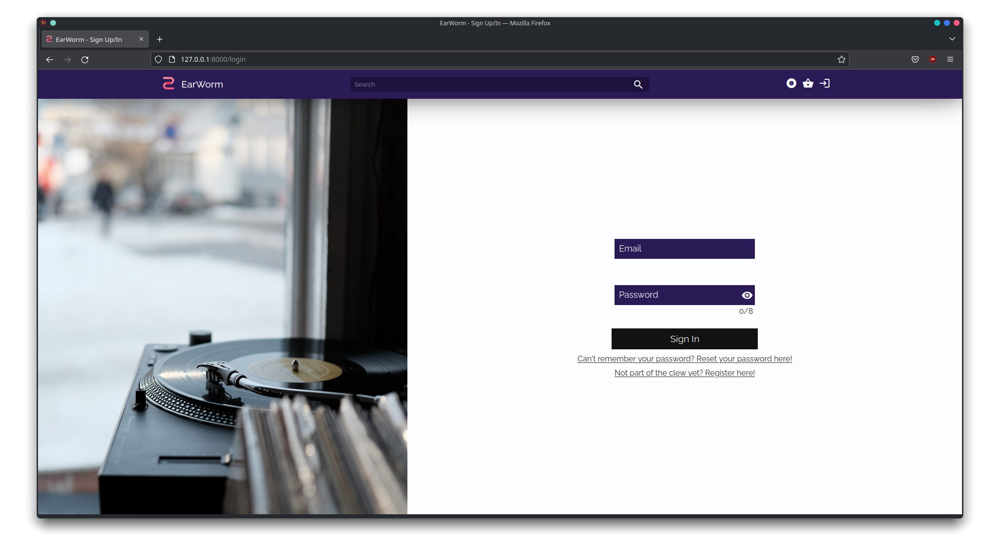

# PA: Product and Presentation

> For music lovers who want a tailored retailer of their favorite artists' releases, EarWorm is a website that provides a trustworthy and all-inclusive selection of music.

## A9: Product

EarWorm website was developed by a small group of FEUP students, with a passion for both music and the preservation of its physical mediums, as a platform targeted at individual users that wish to buy physical musical products.

The main goal of the project is the development of a web-based and individually stylized music store for browsing and buying musical merchandise such as CDs, vinyls or other music affiliated products. After the initial deployment of the site, a team of administrators is required and will be responsible for managing the system and the stock, as well as ensuring any transaction runs smoothly.

This online platform grants users access to a vast library of purchaseable musical content, while also keeping track of their on-site transactions. Products are available for worldwide distribution, providing a myriad of payment options. Curated recommendations will be provided to each user based on their listening preferences.

Users are separated into groups with different permissions. These groups include the site administrators, with complete access and modification privileges, and the registered users, with privileges to enter information, buy and cancel ordered items, browse and inspect the site's products and rate previously obtained items.

The platform will have a responsive design, allowing users to have a pleasant browsing experience not only visually but functionally as well, regardless of the device (desktop, tablet or smartphone).

### 1. Installation

[Link to the final version of the source code](https://git.fe.up.pt/lbaw/lbaw2223/lbaw22123)

In order to install and run follow these steps:

> Start by cloning the repository & entering the directoty
> ```git clone https://git.fe.up.pt/lbaw/lbaw2223/lbaw22123.git & cd lbaw22123```

> Open a terminal window and link laravel's storage and serve a server
> ```php artisan storage:link```
> ```php artisan serve```

> On a separate window start the composer container for the database
> ```docker compose up```

> Be sure to check which ```.env```file you are using during this process (prod or dev)

### 2. Usage

If you are locally deployed and running your own server, you may visit ```http://127.0.0.1:8000``` to start using the application.

If you have access to FEUP's VPN server you may also visit the deployed page at ```http://lbaw22123.lbaw.fe.up.pt``` 

#### 2.1. Administration Credentials

Administration URL: ```http://lbaw22123.lbaw.fe.up.pt/admin```  

| Username             | Password |
| -------------------- | -------- |
| admin@example.com    | password |

#### 2.2. User Credentials

| Type          | Username           | Password     |
| ------------- | ------------------ | ------------ |
| basic account | user@example.com   | userpassword |


### 3. Application Help

> Describe where help has been implemented, pointing to working examples.  

Help may be found throughout the website in many forms, sometimes hidden in plain sight through use of colors and layouts, and some other in a more explicit manner.

**INSERT HELP PAGE SCREENSHOT + SCREENSHOT DE UM FORM COM INPUTS REQUIRED**

### 4. Input Validation

> Describe how input data was validated, and provide examples to scenarios using both client-side and server-side validation.

Throughout a user's interaction with the website, there are many times where they need to provide more thorough and detailed information, such as their address or zip-code. In these instances, it is important to ensure that the user, not only inputs the correct information but also that the state of their inputs is adequate, and that it does not harm the application or other users. This battle is fought in two fronts, in the frontend and the backend.

In the frontend, we use forms that are responsive to user input and that, using HTML's native tools, guide users to the desired behavior and outcome.




However, it is not enough that the user's input is secure at a surface level, we must ensure that when it interacts with our system, its state is not altered unexpectedly. With this goal in mind, we made sure that through the use of middlewares and other validation methods, our inputs were sanitized before and while interacting with the rest of our application.

```php
class UserMiddleware
{
    /**
     * Handle an incoming request.
     *
     * @param  \Illuminate\Http\Request  $request
     * @param  \Closure(\Illuminate\Http\Request): (\Illuminate\Http\Response|\Illuminate\Http\RedirectResponse)  $next
     * @return \Illuminate\Http\Response|\Illuminate\Http\RedirectResponse
     */
    public function handle(Request $request, Closure $next)
    {
        if (Auth::check() && !(Auth::user()->is_admin)) {
            return $next($request);
        } else {
            return back()->withErrors('Only regular users can do that.');
        }
    }
}
```

### 5. Check Accessibility and Usability

> Provide the results of accessibility and usability tests using the following checklists. Include the results as PDF files in the group's repository. Add individual links to those files here.
>
> Accessibility: https://ux.sapo.pt/checklists/acessibilidade/  
> Usability: https://ux.sapo.pt/checklists/usabilidade/  

Accessibility: **_16/18_** 

<br>

Usability: **_24/28_**

### 6. HTML & CSS Validation

> Provide the results of the validation of the HTML and CSS code using the following tools. Include the results as PDF files in the group's repository. Add individual links to those files here.
>   
> HTML: https://validator.w3.org/nu/  
> CSS: https://jigsaw.w3.org/css-validator/  

### 7. Revisions to the Project

During this final phase of the project, many things add to be changed in order to achieve the goals that were set out and implement all of the features we set out to. Following is a list of these changes that were made.

- Added the ```password_resets``` table to store password reset tokens
- Added the ```last_fm``` field to the ```users``` table to store information regarding a user's lastfm profile
- Added the ```is_deleted``` field to the ```users``` table to signal a deleted user profile
- Products can now be discounted, meaning an adequate attribute had to be added to their database table
- We are saving more information regarding the orders as well as the price at which a product was bought
- Reports no longer require a message
- The Last.fm implementation did not require any OAuth authentication, as such that actor is no longer contemplated in our design 

### 8. Web Resources Specification
OpenAPI specification can be found [here](https://git.fe.up.pt/lbaw/lbaw2223/lbaw22123/-/blob/main/docs/a9_openapi.yaml)

### 9. Implementation Details
#### 9.1. Libraries Used

> Flickity: https://flickity.metafizzy.co/

Used for smooth and responsive carousels. Implemented in multiple pages throughout the website, one such page is the homepage of the application, in the [index.js](https://git.fe.up.pt/lbaw/lbaw2223/lbaw22123/-/blob/main/public/js/index.js) file.

> BB-Code-To-HTML: https://coursesweb.net/javascript/convert-bbcode-html-javascript_cs

Whilst not a library, we felt that is important to mention that the code that makes us able to have BBCode on the artist pages and translate it into valid HTML code was not developed by us as it is a moderately complex piece of JavaScript code.

#### 9.2 User Stories

### **User**

|Identifier|Name|Priority|Team Members|State|
|---|---|---|---|---|
|US001|See Homepage|High|**António Santos**, **Pedro Silva**, José Osório, José Castro|100%|
|US002|See Product Page|High|**António Santos**, **José Osório**, **José Castro**, **Pedro Silva**|100%|
|US003|View Product List|High|**António Santos**, **José Osório**, **José Castro**, **Pedro Silva**|100%|
|US004|View Product Details|High|**António Santos**, **José Osório**, **José Castro**, **Pedro Silva**|100%|
|US005|Browse Products|High|**António Santos**, **José Osório**, **José Castro**, **Pedro Silva**|100%|
|US006|Browse Products using Full-text Search|Medium|**José Castro**, **José Osório**|100%|
|US007|Browse Products using Exact-Match Search|Medium|**José Castro**|100%|
|US008|Browse Product Categories|Medium|**José Castro**, **José Osório**, **Pedro Silva**|100%|
|US009|See Other Person's Page|High|**António Santos**, **José Osório**, **José Castro**, **Pedro Silva**|100%|
|US010|See About Us|Medium|**António Santos**, **José Castro**|100%|
|US011|See Help and FAQ|Medium|**António Santos**, **José Castro**|100%|
|US012|See Contacts|Medium|**António Santos**, **José Castro**|100%|
|US013|See Artist Page|Medium|**António Santos**, **José Osório**, **José Castro**, **Pedro Silva**|100%|
|US014|View Product Reviews|Medium|**António Santos**, **José Castro**, José Osório, Pedro Silva|100%|
|US015|Browse Products through Multiple Attributes|High|**Pedro Silva**|100%|
|US016|Filter Products|Medium|**Pedro Silva**|100%|
|US017|Receive Error Messages|Medium|**José Castro**|100%|
|US018|Receive Contextual Help|Medium|**José Castro**|100%| 

### **Visitor**

|Identifier|Name|Priority|Team Members|State|
|---|---|---|---|---|
|US101|Sign-in|High|**José Osório**, António Santos|100%|
|US102|Sign-up|High|**José Osório**, António Santos|100%|
|US103|Add Product to Cart|High|**José Castro**, **Pedro Silva**, José Osório|100%|
|US104|Remove Product from Cart|High|**José Castro**, **Pedro Silva**, José Osório|100%|

### **Client**

|Identifier|Name|Priority|Team Members|State|
|---|---|---|---|---|
|US201|Sign-out|High|**José Osório**, António Santos|100%|
|US202|Checkout|High|**José Osório**, **Pedro Silva**|100%|
|US203|View Purchase History|Medium|**José Osório**, António Santos|100%|
|US204|View Profile|High|**António Santos**, **José Osório**, **José Castro**, **Pedro Silva**|100%
|US205|Edit Profile|High|**José Osório**, António Santos, José Castro, Pedro Silva|100%|
|US206|Delete account|Medium|**José Osório**, António Santos, José Castro, Pedro Silva|100%|
|US207|Insert Profile Picture|Medium|**José Osório**, António Santos|100%|
|US208|Review Product|Medium|**José Castro**, António Santos, Pedro Silva|100%|
|US209|Edit Review|Medium|**José Castro**, António Santos, Pedro Silva|100%|
|US210|View Reviews|Medium|**José Castro**, António Santos, Pedro Silva|100%|
|US211|Remove Review|Medium|**José Castro**, António Santos, Pedro Silva|100%|
|US212|Add Product to Wishlist|Medium|**José Osório**, António Santos, José Castro|100%|
|US213|Remove Product from Wishlist|Medium|**José Osório**, António Santos, José Castro|100%|
|US214|Favorite Artist|Medium|**António Santos**|100%|
|US215|Unfavorite Artist|Medium|**António Santos**|100%|
|US216|Sign-in to Last.fm|Medium|**José Osório**, António Santos|100%|
|US217|Sign-out of Last.fm|Medium|**José Osório**, António Santos|100%|
|US218|Receive Product Recommendations|Medium|**José Osório**, António Santos|100%|
|US219|Cancel Order|Medium|**José Osório**, José Castro|100%|
|US220|Receive Payment Approval Notification|Medium|**José Castro**|100%|
|US221|View Personal Notification|Medium|**José Castro**|100%|
|US222|Receive Order Status Change Notification|Medium|**José Castro**|100%|
|US223|Receive Wishlist Product Available Notification|Medium|**José Castro**|100%|
|US224|Recover Password|Medium|**José Castro**|100%|

### **Administrator**

|Identifier|Name|Priority|Team Members|State|
|---|---|---|---|---|
|US301|Manage client accounts|High|**António Santos**, **José Osório**, **José Castro**, **Pedro Silva**|100%|
|US302|Create Administrator accounts|Medium|**António Santos**, **José Osório**|100%|
|US303|Block client accounts|High|**António Santos**, **José Osório**|100%|
|US304|Unblock client accounts|High|**António Santos**, **José Osório**|100%|
|US305|Delete client accounts|High|**António Santos**, **José Osório**|100%|
|US306|View Client's purchase history|Medium|**António Santos**, **José Osório**, **José Castro**, **Pedro Silva**|100%|
|US307|Add product|Medium|**António Santos**, **José Castro**, **Pedro Silva**|100%|
|US308|Manage product|Medium|**António Santos**, **José Castro**, **Pedro Silva**|100%|
|US309|Manage product stock|Medium|**António Santos**, **José Castro**, **Pedro Silva**|100%|
|US310|Manage artist page|Medium|**António Santos**, **José Osório**, **José Castro**, **Pedro Silva**|100%|
|US311|Manage an Order's status|Medium|**António Santos**, **José Osório**|100%|
|US312|Delete comments|Medium|**José Castro**|100%|

## A10: Presentation
 
> This artifact corresponds to the presentation of the product.

### 1. Product presentation

Earworm is a modern and user friendly online store with a vast catalogue of items and genres to choose from, featuring old and new artists alongside their most sought after records. Such a big collection would not go without a sofisticated approach to searching and filtering results.

Earworm prides itself on knowing their customers and offering personalized listings of their catalogue to each individual user of the platform. More over the website is was designed with keeping key information accessible to the user and as such, users will be glad to know all of their information is safe with us.

### 2. Video presentation

> Screenshot of the video plus the link to the lbawYYgg.mp4 file.


---


## Revision history

Changes made to the first submission:
1. First submission
1. ..

***
GROUP 22123, 03/01/2023

* Pedro Alexandre Ferreira e Silva - up202004985@edu.fe.up.pt (Editor)
* António Oliveira Santos - up202008004@edu.fe.up.pt (Editor)
* José Luís Nunes Osório - up202004653@edu.fe.up.pt (Editor)
* José Maria Borges Pires do Couto e Castro - up202006963@edu.fe.up.pt (Editor)* ...